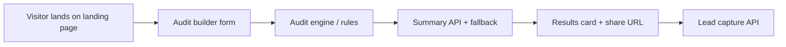

# Architecture

## Data flow
1. The browser stores tool rows and team/use-case fields in localStorage.
2. The audit engine computes total monthly savings, per-tool recommendations, and a public summary.
3. The summary route uses Anthropic when an API key is present; otherwise it falls back to a deterministic template.
4. The public share URL encodes only the audit payload, keeping PII out of the public route.

## Why this stack
- Next.js App Router keeps the landing page, API routes, and public URL in one deployable app.
- TypeScript keeps the rules and recommendations easy to read and test.
- Vitest gives a stable unit-test layer for the audit math.

## If traffic grows to 10k audits/day
- Move lead capture and share payload storage to Supabase or Postgres.
- Cache summary generation and precompute common rule sets.
- Add queue-based email delivery and rate-limit persistence.
